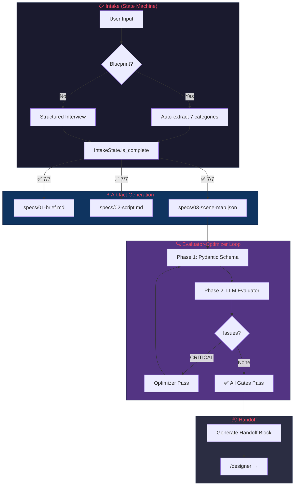
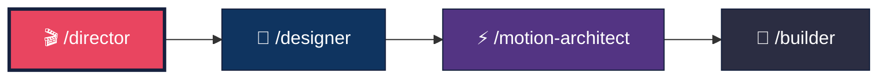

<p align="center">
  <h1 align="center">🎬 The Director</h1>
  <p align="center">
    <strong>World-class pre-production AI agent for video pipelines</strong>
  </p>
  <p align="center">
    <a href="#architecture"></a>
    <a href="#contracts"></a>
    <a href="LICENSE"></a>
    <a href="#tests"></a>
    <a href="#"></a>
  </p>
</p>

---

**The Director** is Agent 1 in a multi-agent video production pipeline. It front-loads every creative, structural, and narrative decision into the "cheap phase" — before a single pixel is designed or a single frame is animated.

> *"Changing a moodboard takes 30 minutes. Changing a finished animation takes 8 hours."*

This is not a prompt document. It is a **production-grade agent** with Pydantic-enforced contracts, a state-machine intake loop, an evaluator-optimizer pass, and native Claude Agent SDK integration. Every artifact is type-checked before it can leave the agent.

---

## ✨ What Makes This Different

| Dimension | Basic Prompt Agent | **The Director** |
|-----------|-------------------|-----------------|
| Contract enforcement | Checklist in system prompt | `ValidationError` at generation time |
| Intake process | Bullet-point instructions | `IntakeState` enum-tracked state machine |
| Validation | Manual review | `ArtifactValidator` — two-phase evaluator |
| Error recovery | None | `_optimizer_pass()` re-runs with failure context |
| Frame math | "Please check the math" | `@model_validator` raises on mismatch |
| SDK integration | Generic assistant prompt | Native `.claude/commands/`, `CLAUDE.md`, async streaming |
| System prompt | Markdown headers | XML-structured ACI (Agent-Computer Interface) |
| Handoff | Copy-paste template | Dynamic from validated `SceneMapModel` |

---

## 🏗️ Architecture

<a name="architecture"></a>



---

## 🚀 Quick Start

### Installation

```bash
# Clone the repo
git clone https://github.com/sufianmypa1203-oss/the-director.git
cd the-director

# Install dependencies
pip install -e ".[dev]"
```

### Usage

```bash
# Start a fresh intake session
/director

# Skip intake with an existing blueprint
/director "Topic: subscription creep. Platform: TikTok. Duration: 15s..."

# Resume an incomplete session
/director --resume subscription-creep
```

### Programmatic Usage

```python
import asyncio
from src.director import DirectorAgent

async def main():
    agent = DirectorAgent(project_id="subscription-creep")
    async for chunk in agent.run("Create a 15s TikTok about hidden subscription costs"):
        print(chunk, end="", flush=True)

asyncio.run(main())
```

### Validate an Existing Scene Map

```python
import json
from src.director.models import SceneMapModel

with open("examples/subscription-creep/scene-map.json") as f:
    data = json.load(f)

# This will raise ValidationError if anything is wrong
scene_map = SceneMapModel(**data)
print(f"✅ Valid: {len(scene_map.scenes)} scenes, {scene_map.totalDuration} frames")
```

---

## <a name="contracts"></a> 📐 Contract System

The Director enforces **compile-time guarantees** on all video production artifacts via Pydantic models.

### What Gets Validated

| Contract | Validates | On Failure |
|----------|-----------|------------|
| `SceneModel` | Frame math, word counts, Hick's Law, hook-not-logo | `ValidationError` |
| `TransitionModel` | Narrative reason present (≥10 chars), no technique specs | `ValidationError` |
| `SceneMapModel` | Total duration, scene continuity, all transitions, unique IDs | `ValidationError` |
| `IntakeState` | 7/7 categories completed before generation | `is_complete() = False` |
| `BriefModel` | Zero blank fields, valid dimensions, framework justification | `ValidationError` |

### Example: Frame Math Enforcement

```python
from src.director.models import SceneModel

# This PASSES ✅
scene = SceneModel(
    id="scene-1", name="Hook", role="hook",
    startFrame=0, endFrame=120,
    durationFrames=120, durationSeconds=4.0,     # 120/30 = 4.0 ✅
    emotionalBeat="alarm", emotionArc="curiosity → shock",
    colorTemperature="warm", focalPoint="hero-number",
    focalIsolation="unique-scale",
    heroText="$4,652 leaked",                     # 2 words ≤ 7 ✅
    subText="Subscriptions you forgot",           # 3 words ≤ 12 ✅
    prototypeFile="Scene1_Hook.html", maxInfoItems=3,
)

# This FAILS ❌ — wrong frame math
SceneModel(
    id="scene-1", name="Hook", role="hook",
    startFrame=0, endFrame=120,
    durationFrames=100,                            # Should be 120!
    durationSeconds=4.0,
    # ... ValidationError: durationFrames (100) ≠ endFrame (120) - startFrame (0)
)
```

### JSON Schema Export

```python
from src.director.models import SceneMapModel

# Export JSON Schema for downstream tooling
schema = SceneMapModel.model_json_schema()
print(json.dumps(schema, indent=2))
```

---

## 🔍 Evaluator-Optimizer Loop

After generating all 3 artifacts, a **separate validation pass** runs:

1. **Deterministic (Pydantic)** — Schema validation, frame math, word counts, continuity
2. **LLM Evaluator** — Narrative coherence, hook compliance, reading speed
3. **Optimizer** — If critical issues found → re-run generation with failure context
4. **Gate** — Only when ALL checks pass → handoff block is emitted

```python
from src.director.validator import ArtifactValidator

validator = ArtifactValidator()
issues = validator.run_all_deterministic()
print(validator.format_report(issues))
# ✅ All validations passed. Artifacts are clean.
```

---

## 📁 Project Structure

```
the-director/
├── README.md                          ← You are here
├── AGENT.md                           ← Architecture documentation
├── CLAUDE.md                          ← Agent persistent memory (SDK native)
├── CONTRIBUTING.md                    ← How to contribute
├── LICENSE                            ← MIT License
├── pyproject.toml                     ← Python packaging + dependencies
├── .gitignore
│
├── .claude/
│   └── commands/
│       └── director.md                ← /director slash command
│
├── src/
│   ├── director/
│   │   ├── __init__.py                ← Package exports
│   │   ├── agent.py                   ← DirectorAgent class (async SDK loop)
│   │   ├── models.py                  ← Pydantic contracts (THE source of truth)
│   │   ├── validator.py               ← ArtifactValidator (evaluator-optimizer)
│   │   ├── tools.py                   ← ACI-engineered tools
│   │   └── prompts.py                 ← System prompt (XML-structured)
│   └── pipeline/
│       ├── __init__.py
│       └── router.py                  ← Slash command router
│
├── examples/
│   └── subscription-creep/
│       ├── scene-map.json             ← Fully valid example output
│       ├── brief.md                   ← Example brief
│       └── script.md                  ← Example script
│
├── knowledge/
│   ├── pre_production.md              ← Intake protocol + emotion table
│   └── script_and_copy.md            ← Word limits, hook science, frameworks
│
├── tests/
│   └── test_director.py              ← Comprehensive test suite
│
└── specs/                             ← Director output (auto-created at runtime)
```

---

## 🧪 <a name="tests"></a> Testing

```bash
# Run all tests
python -m pytest tests/ -v

# Run with coverage
python -m pytest tests/ -v --cov=src/director

# Run a specific test class
python -m pytest tests/test_director.py::TestSceneModel -v
```

### What's Tested

- ✅ Frame math enforcement (mismatch → `ValidationError`)
- ✅ Word count limits (hero ≤7, sub ≤12)
- ✅ Hook-not-logo rule
- ✅ Scene continuity (no gaps or overlaps)
- ✅ Total duration consistency
- ✅ Missing transitions detection
- ✅ Duplicate scene ID detection
- ✅ Intake state machine progression
- ✅ Transition narrative minimum length
- ✅ Reading speed validation
- ✅ Example scene-map validation (ensures examples stay valid)

---

## 🔗 Pipeline Position

The Director is **Agent 1 of 4** in the video production pipeline:



| Agent | Responsibility | Reads | Produces |
|-------|---------------|-------|----------|
| **`/director`** ← You are here | Intake, brief, script, scene-map | User input | `specs/01-brief.md`, `specs/02-script.md`, `specs/03-scene-map.json` |
| `/designer` | Visual design, HTML prototypes | All 3 specs | Design spec + HTML prototypes per scene |
| `/motion-architect` | Motion physics, springs, easing | Scene-map + design spec | Motion spec with spring constants |
| `/builder` | `.tsx` code, Remotion composition | All upstream specs | Final production code |

---

## 🎯 Hard Rules (Contract-Enforced)

These aren't suggestions. They're enforced by Pydantic validators that raise `ValidationError`:

| Rule | Enforcement |
|------|-------------|
| No scene > 150 frames (5s) | `SceneModel.validate_frame_math()` |
| ≤ 4 info items per scene (Hick's Law) | `SceneModel.maxInfoItems` max=4 |
| Hero text ≤ 7 words | `SceneModel.hero_text_limit()` |
| Sub text ≤ 12 words | `SceneModel.sub_text_limit()` |
| Hook ≠ logo | `SceneModel.hook_not_logo()` |
| Contiguous scenes (no gaps) | `SceneMapModel.validate_scene_continuity()` |
| All transitions present | `SceneMapModel.validate_all_transitions_present()` |
| Frame math exact | `durationFrames = endFrame - startFrame` |
| Reading speed ≤ 8 words / 3s | `ArtifactValidator.validate_reading_speed()` |

---

## 🧠 Design Philosophy

This agent is built on **three principles** from Anthropic's agent engineering research:

1. **Simplicity in design** — State machine intake, not a decision tree. Pydantic contracts, not checklists.
2. **Transparency in planning** — Every decision is documented in the brief. Every constraint is traceable to a validator.
3. **Deep ACI investment** — XML-structured prompts, tool descriptions that match how Claude uses tools, error messages that tell the agent what to fix.

---

## 📄 License

[MIT](LICENSE) — Use it, fork it, improve it.

---

## 🤝 Contributing

See [CONTRIBUTING.md](CONTRIBUTING.md) for guidelines.

---

<p align="center">
  <sub>Built with the <a href="https://github.com/sufianmypa1203-oss/my-agents-and-skill">Elite Factory Hub</a> — World-Class Agent Architecture</sub>
</p>
